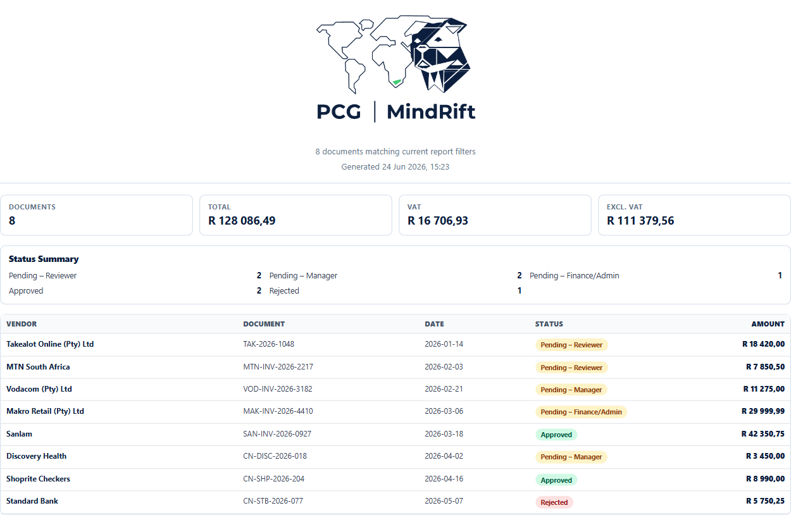
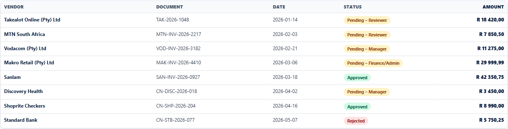

# DocFlow

Document approval and reporting workspace for PCG | MindRift.

DocFlow helps teams capture invoices and credit notes, route them through a simple approval process, and export clean reporting packs for review.

## Overview

- Document intake for invoices and credit notes
- Duplicate document checks
- Three-stage approval workflow
- Role-based workspace access
- Spend, VAT, vendor, and status reporting
- Excel and PDF report exports
- Clean demo data for reviewer walkthroughs

## Screenshots

### Report Overview



### Report Table



## Local Run

Install and start the server:

```bash
cd server
npm install
npm run dev
```

Install and start the client:

```bash
cd client
npm install
npm run dev
```

The client runs locally on `http://localhost:5173`.

## Notes

- Runtime credentials and environment values are not documented in this public README.
- Demo access details are shared separately with reviewers.
- This README is intentionally brief and omits private technical details.
